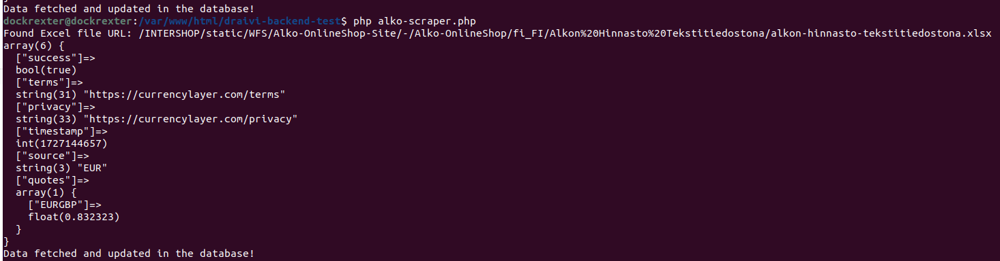
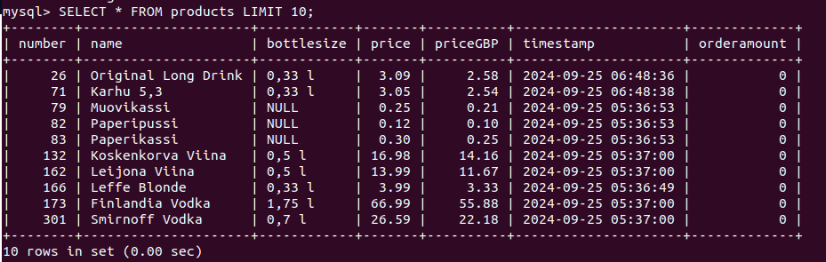
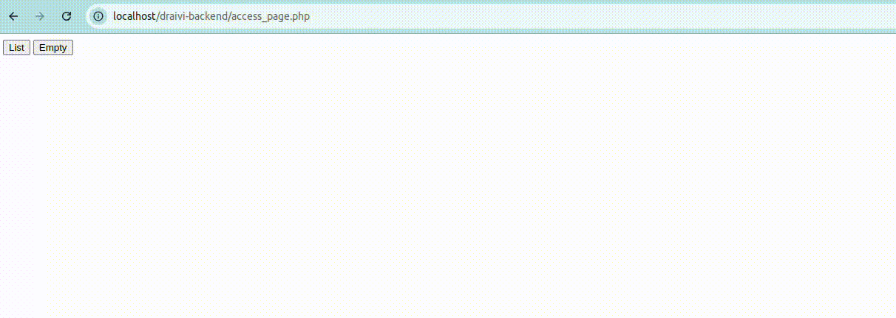

# Draivi Backend Test

## Prerequisites

- PHP (version 8 or higher)
- Composer
- php-xml php-gd php-simplexml php-xmlwriter
- mysql

## Installation

1. Clone the Repository

   ```bash
   git clone <repository-url>

   cd <repository-folder>
   ```
2. Move the repository to webserver i.e apache2
    ```bash
    sudo mv <path to>/draivi-backend /var/www/html/

    ```

3. Install dependencies
    ```bash
   composer install
   ```


## Part 1: Database and Scripting


### SQL Setup:
1. Open your MySQL terminal create the database and schema:

   ```bash
    mysql -u <user> -p

    # Create database
    CREATE DATABASE draivi_backend;

    USE draivi_backend;
    SOURCE /path/to/schema.sql;
    ```
2. Run SQL script to inser schema.
    ```bash
    sudo mysql -u <user> -p draivi_backend < schema.sql
    ```
### Environment setup:

1. you need to define your environment variables in a .env file

    ```bash
    HOST =localhost
    DB =draivi_backend
    DB_USER =user  
    DB_PASS =password
    CURRENCY_LAYER_API_KEY =**df3ed19****06e9d128c**
    ```
### Run Scraper:

1. To run the scrapper you need to run the command below:

    ```bash
    php alko-scraper.php
    ```
    Expected Output should be:

    

2. You can also view the data in table by:

   ```bash
    mysql -u <user> -p
    use draivi_backend;
    SELECT * FROM products LIMIT 10;
    ```
    Expected Output should be:

    


## Part 2: Ajax access to data

Open your browser with the link below and you will see the below output.
```bash
http://localhost/draivi-backend/access_page.php
```




